# SOCIAL MEDIA REST API

This is an API which can used for social media platform with covering the following core functionalities.

- User authentication with **JWT**
- User profile creation
- User post creation
- Adding the crud functionalites all these resources
- With keeping in mind the security and privacy of the user data

It is made using **Node.js** and **Express.js** with **MongoDB** cluster provided by MongoDB Atlas as database. For API testing **Insomnia** was used.

This is an ready to go API which can be easily configured with any frontend.

## API Documentation:

API endpoints: For example the node server is running on localhost:5000 then endpoints will be -

#### User and Auth

1. ```POST http://localhost:5000/users/register``` - This endpoint is used for registering and user and it expects a JSON sent to it in the following format.


	```json
	{
	"firstName": "jane",
	"lastName": "doe",
	"email": "jane@gmail.com",
	"password": "janed"
	}
	```

	This is will create an user and send the user info as response as well as set the cookie in the browser named as jwt as the authentication cookie.

	The response: -

	```json
	{
		"_id": "5f76c8fb5bef7060c1a4d1d4",
		"firstName": "jane",
		"lastName": "doe",
		"email": "jane@gmail.com",
		"password": "$2b$10$91Tpg34A4wvM/XsCUVGapuLLnde5FSDGnkNm5SXnzNfOFFRPTnsM2",
		"createdAt": "2020-10-02T06:30:19.338Z",
		"updatedAt": "2020-10-02T06:30:19.338Z",
		"__v": 0
	}
	```

	The cookie: -

	<p align="center">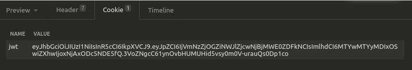</p>


2. ```POST http://localhost:5000/auth/login``` - This endpoint is used for login which expects a JSON to be sent in this format.
	```json
	{
	"email": "akash@gmail.com",
	"password": "akash"
	}
	```
	This request returns the user as json and sets JWT for future requests which will require authentications.

#### User Profiles

1. ```GET http://localhost:5000/profile/create``` - This endpoint is used to fetch the csrf token which is required to be sent as HEADER with name XSRF-TOKEN while creating profile. This token is sent as cookie.
	<p align="center">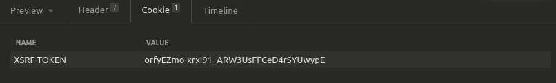</p>

2. ```POST http://localhost:5000/profile/``` - Used for creating profile and takes JSON or multipart/form as input. This request requires XSRF-TOKEN received from the previous endpoint above to be sent as header.
	<p align="center">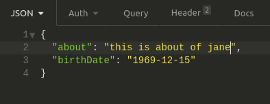</p>
	<p align="center">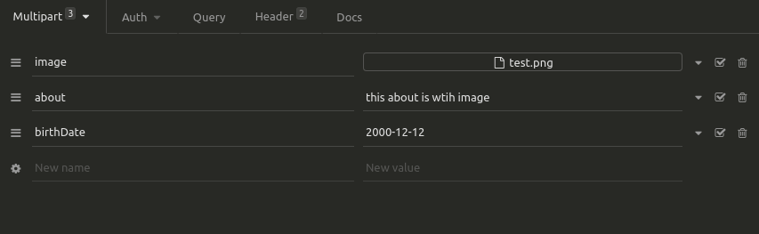</p>
3. ```GET http://localhost:5000/profile/edit``` - This endpoint is used to fetch the csrf token which is required to be sent as XSRF-TOKEN while editing profile. This token is sent as cookie.
	<p align="center"></p>
4. ```PUT http://localhost:5000/profile/``` - Used for creating profile and takes JSON or multipart/form as input. This request requires XSRF-TOKEN received from the previous endpoint above to be sent as header.
	<p align="center">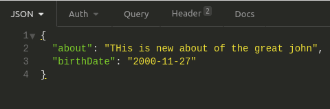</p>
	<p align="center">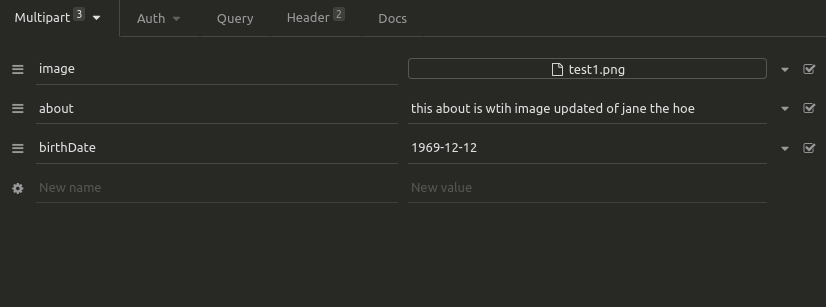</p>
5 ```GET http://localhost:5000/profile/me``` - Sends profile of the logged in user as JSON object
	<p align="center">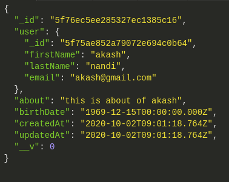</p>
6. ```GET http://localhost:5000/profile/user-id``` - Sends the profile as the JSON object of the user whose id fields matches user-id in uri.
7. ```GET http://localhost:5000/profile/``` - Sends an array of the profiles of all users.
8. ```DELETE http://localhost:5000/profile``` - This request deletes profile of the user, the posts made by the user and user itself.
9. ```GET http://localhost:5000/profile/image/image-name``` - Fetches the profile picture with name image-name.

#### Posts

1. ```GET http://localhost:5000/posts/create``` - This returns the csrf token for creating the post.
2. ```POST http://localhost:5000/posts``` - This route sends the post request to server to create a post and logged in user will be the author of the post. It can receive both JSON and multipart/form data as request body data. This request requires XSRF-TOKEN received from the previous endpoint above to be sent as header.
	<p align="center">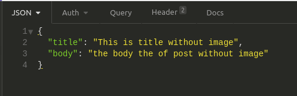</p>
	<p align="center">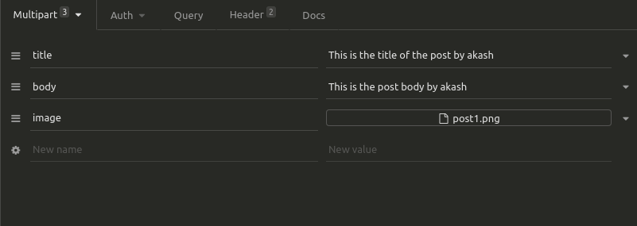</p>
3. ```GET http://localhost:5000/posts/edit``` - This returns the csrf token for editing the post.
4. ```PUT http://localhost:5000/posts/post_id``` - This route sends the putt request to server to edit a post and logged in user will be the author of the post. It can receive both JSON and multipart/form data as request body data. It finds the post whose id fields matches with post_id and updates the post. This request requires XSRF-TOKEN received from the previous endpoint above to be sent as header.
	<p align="center">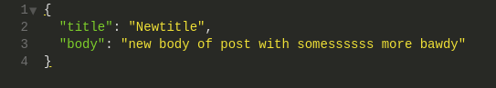</p>
	<p align="center">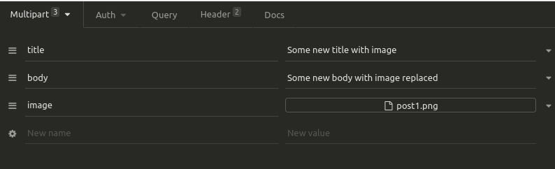</p>
5. ```GET http://localhost:5000/posts/post_id``` - Sends the post whose id matches post_id as JSON object as response.
6. ```DELETE http://localhost:5000/posts/post_id``` - Deletes the post with an id as post_id.
  Note: All these post mutating requests only allow the author of the post to change/delete the post.

7. ```GET http://localhost:5000/posts``` - Sends array of all posts as response.

8. ```POST http://localhost:5000/posts/comment/post_id``` - This endpoint expects a JSON of the following format.
	```json
	{
	  "body": "test comment 3"
	}
	```
	This comment is added with post whose id matches post_id.

9. ```DELETE http://localhost:5000/posts/comment/post_id/comment_id``` - This endpoint finds the post whose id matches post_id and looks for a comment with id of comment_id, if found then it is deleted.

10. ```POST http://localhost:5000/posts/like/post_id``` - A like is added with post whose id matches post_id if only it is not already liked by the user logged in user.

11. ```DELETE http://localhost:5000/posts/like/post_id/comment_id``` - This endpoint finds the post whose id matches post_id and removes the like of the post by the logged in user.

12. ```GET http://localhost:5000/posts/image/image_name``` - This endpoint returns a post image with stored in the server with name as image_name

## Usage: 

1. Download the project, navigate to project directory
2. Make sure you have node and npm installed on your system
3. First install the dependencies. Run this command in the project directory which will install all dependencies from package.json
	```
	npm i
	```
4. Go to the .env file in the root of the project directory, change the value of DB_URI to your own MongoDb database uri. You can create a MongoDB Atlas account which provides free 500MB server or install MongoDB to your local machine and provide that uri.
4. All done, to run the server run this command
	```
	npm start
	```

#### Error Handling:

We all know we can screw up things very easily in making API requests, so I have followed simple and easy to understand error response format which can easily be understood and necessary adjustments can be made intuitivelty.

```json
{
  "errors": [
    {
      "msg": "The error messages",
      "param": "cause of the error"
    },
  ........//and so on
  ]
}
```

## Main Packages used:
 - express for the server and routing.
 - express-validator for data validation.
 - bcrpyt for password hashing
 - csurf for csrf protection
 - dotenv for .env for configuration files.
 - mongoose as MongoDB orm
 - express-fileupload for file uploading.
 - jsonwebtoken for generating jwt tokens for authentication.

## Security:

1. For security measures jwt token is stored in a httpOnly cookie which benefits the following ways
	- Disables client side JavaScript to access this cookie which mitigates xss attacks.
	- For every request the cookie is automaticaly sent to the api server.
2. For CSRF attacks, csurf package is used to generate tokens and authenticate the token in the api server.